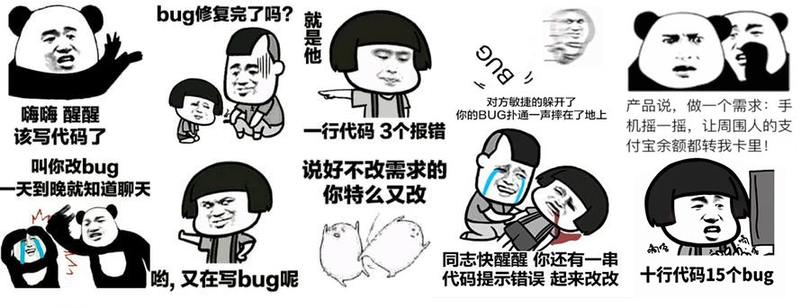

# Hey there :wave:

## About me :octocat:
hello everyone, I am Chinese, My name is Liu Kun, You can call me `Liu` and I am a web development engineer.

Welcome to exchange technology with me. :stuck_out_tongue:

## Things I am passionate about :robot:

- JavaScript
- VueJS
- Webpack
- Typescript
- Node

## Get in touch :coffee:

- Updating...

## Github Stats

## Visitor count

## Guestbook ([og-liu/readme-guestbook](https://github.com/og-liu/readme-guestbook))

<a href="https://readme-guestbook.now.sh">Sign it!</a>

<!--START_SECTION:guestbook-->
[@vybhav72954](https://github.com/vybhav72954) says:

> So many wonderful things in this Git account, when will you be publishing the /assign action?

11/06/2020

---

[@ahmadnassri](https://github.com/ahmadnassri) says:

> Jason makes nice things!

10/23/2020

---

[@StarSheriff2](https://github.com/StarSheriff2) says:

> Hi!

10/12/2020

---

[@syofyanzuhad](https://github.com/syofyanzuhad) says:

> Hi Jason, from 🇮

10/08/2020

---

[@ajkachnic](https://github.com/ajkachnic) says:

> woah hi there!

09/22/2020

<!--END_SECTION:guestbook-->
<!--GUESTBOOK_LIST [{"name":"vybhav72954","message":"So many wonderful things in this Git account, when will you be publishing the /assign action?","date":"11/06/2020"},{"name":"ahmadnassri","message":"Jason makes nice things!","date":"10/23/2020"},{"name":"StarSheriff2","message":"Hi!","date":"10/12/2020"},{"name":"syofyanzuhad","message":"Hi Jason, from 🇮","date":"10/08/2020"},{"name":"ajkachnic","message":"woah hi there!","date":"09/22/2020"}]-->

<!--
**og-liu/og-liu** is a ✨ _special_ ✨ repository because its `README.md` (this file) appears on your GitHub profile.

Here are some ideas to get you started:

- 🔭 I’m currently working on ...
- 🌱 I’m currently learning ...
- 👯 I’m looking to collaborate on ...
- 🤔 I’m looking for help with ...
- 💬 Ask me about ...
- 📫 How to reach me: ...
- 😄 Pronouns: ...
- ⚡ Fun fact: ...
-->
